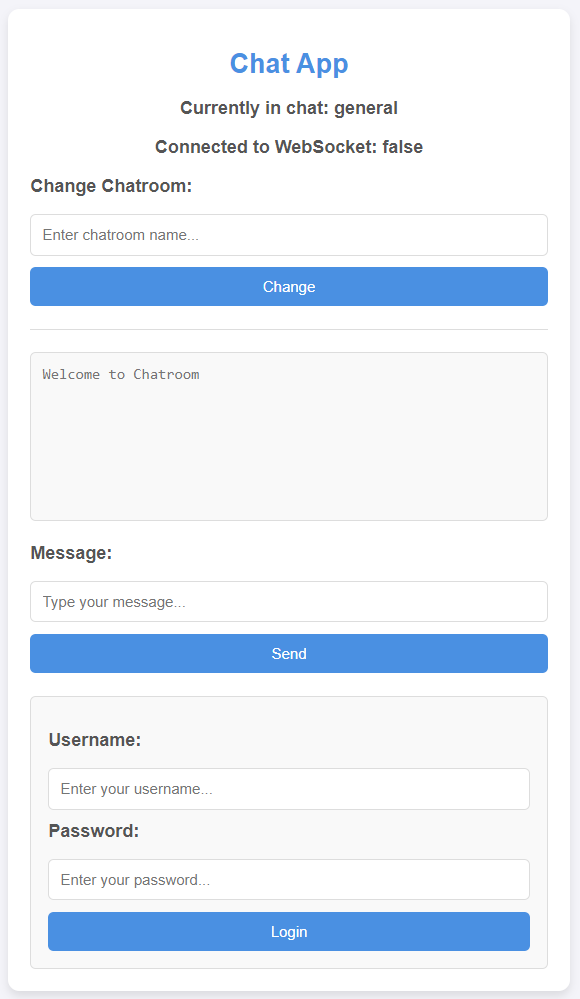
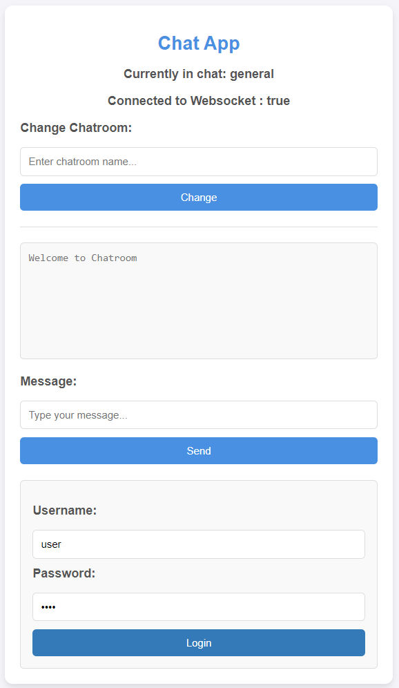
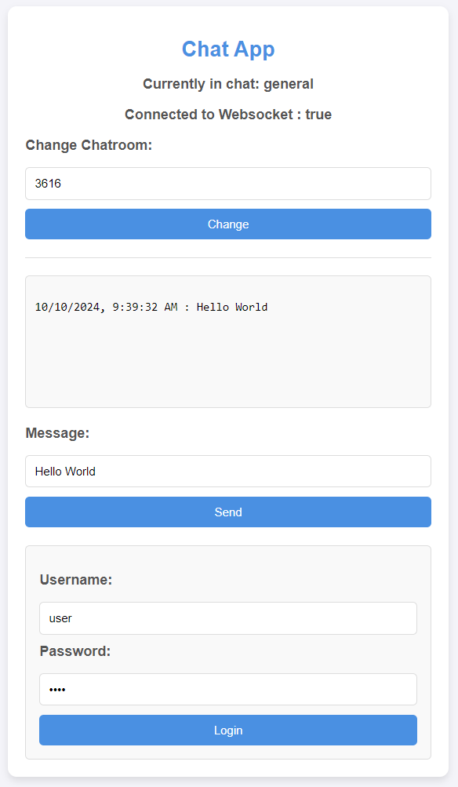

# WebSocket Chat App

 A simple realtime chat app web using WebSocket written in Golang, HTML/CSS, Javascript. This app running in ```localhost:8080``` in the same chatroom.

## ChatApp Features

This project is a starting point for a Flutter application.

* Mutliuser in the same room
* Using token for WebSocket Auth

### Clone and Setup
1.  Clone the repository:
    ```bash
    git clone https://github.com/mariopandapotansimarmata/go-chat-app-websocket
2.  Install Module:
    ```bash
    go mod tidy
    
### Run
1.  Run the App using air:
    ```bash
    air  


### How to use

This project is a starting point for a Flutter application.

1.  Open borwser ```localhost:8080```.
2.  Login using username ```user``` and password ```user```.
3.  If login success, the WebSocket is connected. You can send a message in message section and WebSocket will listen to client.

## UI Screenshots
   
